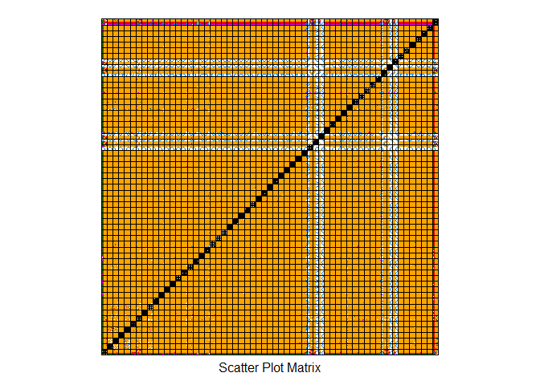

# Practical ML
Dmitri Peredera  
28 februari 2016  

# Assignment: Prediction Assignment Writeup # 


## Background ##

Using devices such as Jawbone Up, Nike FuelBand, and Fitbit it is now possible to collect a large amount of data about personal activity relatively inexpensively. These type of devices are part of the quantified self movement – a group of enthusiasts who take measurements about themselves regularly to improve their health, to find patterns in their behavior, or because they are tech geeks. One thing that people regularly do is quantify how much of a particular activity they do, but they rarely quantify how well they do it. In this project, your goal will be to use data from accelerometers on the belt, forearm, arm, and dumbell of 6 participants. They were asked to perform barbell lifts correctly and incorrectly in 5 different ways. More information is available from the website here: http://groupware.les.inf.puc-rio.br/har (see the section on the Weight Lifting Exercise Dataset). 

## Task ##

The goal of your project is to predict the manner in which they did the exercise. This is the "classe" variable in the training set. You may use any of the other variables to predict with. You should create a report describing how you built your model, how you used cross validation, what you think the expected out of sample error is, and why you made the choices you did. You will also use your prediction model to predict 20 different test cases.

## Data ##

The training data for this project are available here:

[https://d396qusza40orc.cloudfront.net/predmachlearn/pml-training.csv](https://d396qusza40orc.cloudfront.net/predmachlearn/pml-training.csv)

The test data are available here:

[https://d396qusza40orc.cloudfront.net/predmachlearn/pml-testing.csv](https://d396qusza40orc.cloudfront.net/predmachlearn/pml-testing.csv)

The data for this project come from this source: [http://groupware.les.inf.puc-rio.br/har](http://groupware.les.inf.puc-rio.br/har). 
If you use the document you create for this class for any purpose please cite them as they have been very generous in allowing their data to be used for this kind of assignment. 

## Preparation ##


```r
rm(list=ls())
setwd("~/R Projects/Coursera/8 - Practical Machine Learning/PML")

library(caret)
```

```
## Loading required package: lattice
## Loading required package: ggplot2
```

```r
library(rpart)
library(rpart.plot)

library(rattle)
```

```
## Rattle: A free graphical interface for data mining with R.
## Version 4.0.5 Copyright (c) 2006-2015 Togaware Pty Ltd.
## Type 'rattle()' to shake, rattle, and roll your data.
```

```r
library(randomForest)
```

```
## randomForest 4.6-12
## Type rfNews() to see new features/changes/bug fixes.
## 
## Attaching package: 'randomForest'
## 
## The following object is masked from 'package:ggplot2':
## 
##     margin
```

```r
library(corrplot)

set.seed(12345) # like always...
```

## Download and clean the data ##

Load the csv data. A quick look shows that both test and train data have NA values and
the train data has additional "#DIV/0!" values that can be encoded as NA.


```r
testUrl <- "http://d396qusza40orc.cloudfront.net/predmachlearn/pml-testing.csv"
trainUrl <- "http://d396qusza40orc.cloudfront.net/predmachlearn/pml-training.csv"

#test <- read.csv(url(testUrl), na.strings=c("NA","#DIV/0!",""))
#train <- read.csv(url(trainUrl), na.strings=c("NA","#DIV/0!",""))

# for test use.
test <- read.csv("pml-testing.csv", na.strings=c("NA","#DIV/0!",""))
train <- read.csv("pml-training.csv", na.strings=c("NA","#DIV/0!",""))
```

Create partitions


```r
inTrain  <- createDataPartition(train$classe, p=0.7, list=FALSE)

trainSet <- train[inTrain, ]
testSet  <- train[-inTrain, ]
```

Both sets should now have 160 variables, but there is some data that needs to be removed.
Like variables with near zero variance.


```r
NZVars <- nearZeroVar(trainSet)

trainSet <- trainSet[, -NZVars]
testSet  <- testSet[, -NZVars]
```

Some columns include mostly NA values, better to remove those or the predicion will fail with error.
The nice solution is available here: [Remove columns from dataframe where ALL values are NA](http://stackoverflow.com/questions/2643939/remove-columns-from-dataframe-where-all-values-are-na)


```r
notna    <- sapply(trainSet, function(x) mean(is.na(x))) > 0
trainSet <- trainSet[, !notna]
testSet  <- testSet[, !notna]
```

At that moment, the test set should only include this reduced set of data:


```r
dim(testSet)
```

```
## [1] 5885   59
```
and the training set 

```r
dim(trainSet)
```

```
## [1] 13737    59
```

Feature plot of dataset (slow) [more examples](http://topepo.github.io/caret/visualizations.html)
The plot shows (very small sized) pictures of possible dependencies.


```r
featurePlot(x=trainSet, y = trainSet$classe, plot="pairs") #runs for 30 min
```

 

# Decision Tree ML #

Make a Decision Tree ML and draw it using fancyplot.


```r
dt_pred <- rpart(classe~., data=trainSet, method="class")
fancyRpartPlot(dt_pred)
```

 

Create a confusion matrix and print it.


```r
prediction_dt <- predict(dt_pred, newdata=testSet, type="class")
matrix_dt <- confusionMatrix(prediction_dt, testSet$classe)
matrix_dt
```

```
## Confusion Matrix and Statistics
## 
##           Reference
## Prediction    A    B    C    D    E
##          A 1673    0    0    0    0
##          B    1 1138    0    0    0
##          C    0    1 1026    1    0
##          D    0    0    0  963    0
##          E    0    0    0    0 1082
## 
## Overall Statistics
##                                           
##                Accuracy : 0.9995          
##                  95% CI : (0.9985, 0.9999)
##     No Information Rate : 0.2845          
##     P-Value [Acc > NIR] : < 2.2e-16       
##                                           
##                   Kappa : 0.9994          
##  Mcnemar's Test P-Value : NA              
## 
## Statistics by Class:
## 
##                      Class: A Class: B Class: C Class: D Class: E
## Sensitivity            0.9994   0.9991   1.0000   0.9990   1.0000
## Specificity            1.0000   0.9998   0.9996   1.0000   1.0000
## Pos Pred Value         1.0000   0.9991   0.9981   1.0000   1.0000
## Neg Pred Value         0.9998   0.9998   1.0000   0.9998   1.0000
## Prevalence             0.2845   0.1935   0.1743   0.1638   0.1839
## Detection Rate         0.2843   0.1934   0.1743   0.1636   0.1839
## Detection Prevalence   0.2843   0.1935   0.1747   0.1636   0.1839
## Balanced Accuracy      0.9997   0.9995   0.9998   0.9995   1.0000
```

# Random forest ML #

Create a Random Forest fit and print results.


```r
rf_control <- trainControl(method="cv", number=6)
fit_rf <- train(classe~., method="rf", data=trainSet, trControl=rf_control)
fit_rf$finalModel
```

```
## 
## Call:
##  randomForest(x = x, y = y, mtry = param$mtry) 
##                Type of random forest: classification
##                      Number of trees: 500
## No. of variables tried at each split: 41
## 
##         OOB estimate of  error rate: 0.01%
## Confusion matrix:
##      A    B    C    D    E  class.error
## A 3906    0    0    0    0 0.0000000000
## B    1 2657    0    0    0 0.0003762227
## C    0    0 2396    0    0 0.0000000000
## D    0    0    0 2252    0 0.0000000000
## E    0    0    0    0 2525 0.0000000000
```

Make prediction and print confidence matrix for Random Forest.


```r
predict_rf <- predict(fit_rf, newdata=testSet)
matrix_forest <- confusionMatrix(predict_rf, testSet$classe)
matrix_forest
```

```
## Confusion Matrix and Statistics
## 
##           Reference
## Prediction    A    B    C    D    E
##          A 1674    0    0    0    0
##          B    0 1138    0    0    0
##          C    0    1 1026    0    0
##          D    0    0    0  964    0
##          E    0    0    0    0 1082
## 
## Overall Statistics
##                                      
##                Accuracy : 0.9998     
##                  95% CI : (0.9991, 1)
##     No Information Rate : 0.2845     
##     P-Value [Acc > NIR] : < 2.2e-16  
##                                      
##                   Kappa : 0.9998     
##  Mcnemar's Test P-Value : NA         
## 
## Statistics by Class:
## 
##                      Class: A Class: B Class: C Class: D Class: E
## Sensitivity            1.0000   0.9991   1.0000   1.0000   1.0000
## Specificity            1.0000   1.0000   0.9998   1.0000   1.0000
## Pos Pred Value         1.0000   1.0000   0.9990   1.0000   1.0000
## Neg Pred Value         1.0000   0.9998   1.0000   1.0000   1.0000
## Prevalence             0.2845   0.1935   0.1743   0.1638   0.1839
## Detection Rate         0.2845   0.1934   0.1743   0.1638   0.1839
## Detection Prevalence   0.2845   0.1934   0.1745   0.1638   0.1839
## Balanced Accuracy      1.0000   0.9996   0.9999   1.0000   1.0000
```

##  Conclusions ##

This model able predict against the 20 test cases. 
The model was able to predict all 20 observations correctly.

The test set can be aplied for assignment like that:


```r
predictTEST <- predict(fit_rf, newdata=testSet)
```

This was fun, but completely strange and unpractical.
